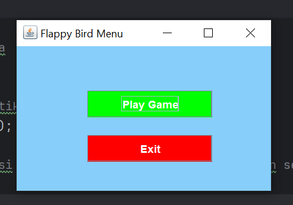
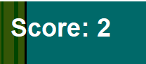
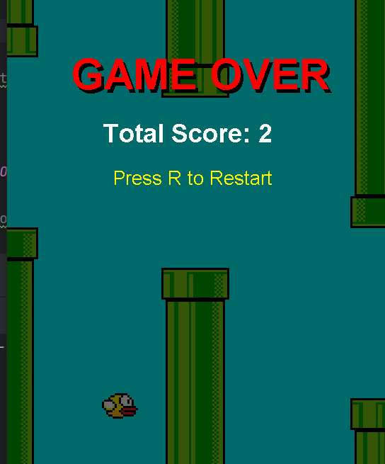
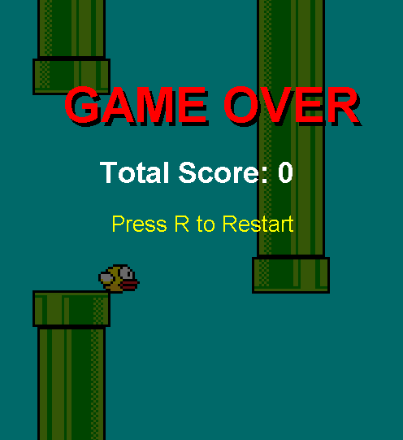

# TP6DPBO2425C2

Saya Niha April Miani dengan NIM 2402567 mengerjakan Tugas Praktikum 6 dalam mata kuliah Desain Pemogramana Berorientasi Objek untuk keberkahanNya maka saya tidak melakukan kecurangan seperti yang telah dispesifikasikan. Aamiin

## Desain Program ##
## 1. App ##
Kelas ini berfungsi sebagai titik awal dari program. Saat dijalankan, kelas ini akan memanggil tampilan menu utama (MainMenu) agar game bisa dimulai dari sana.

## 2. MainMenu ##
Bagian ini menampilkan tampilan awal sebelum permainan dimulai.
Di dalam menu terdapat dua tombol, yaitu _Play Game _untuk memulai permainan dan _Exit_ untuk keluar dari aplikasi.

## 3. Main ##
Kelas ini juga berfungsi untuk menjalankan game, biasanya digunakan jika saya ingin langsung memulai game tanpa melalui menu utama terlebih dahulu.

## 4. Logic ##
Ini merupakan inti dari permainan. Kelas Logic mengatur semua logika seperti gravitasi, kecepatan pipa, skor, kondisi game over, serta proses restart.
Di kelas ini juga terdapat event untuk mendeteksi input keyboard (spasi untuk terbang dan R untuk restart).

## 5. View ##
Kelas ini mengatur tampilan permainan di layar. Semua gambar seperti burung, pipa, dan teks game over ditampilkan melalui kelas ini.
View juga menampilkan skor di pojok kiri atas dan tulisan "Game Over" dengan latar belakang gelap ketika permainan berakhir.

## 6. Player ##
Kelas ini merepresentasikan burung yang dikendalikan oleh pemain.
Atributnya berisi posisi, ukuran, gambar, dan kecepatan jatuh.
Di setiap frame, posisi burung akan diperbarui sesuai dengan efek gravitasi dan input dari pemain.

## 7. Pipe ##
Kelas ini menyimpan informasi tentang pipa, seperti posisi, ukuran, gambar, serta status apakah pipa tersebut sudah dilewati oleh burung atau belum (untuk menambah skor).

## Alur Program ##
## 1. Menu Awal ##
Saat program dijalankan, tampilan yang pertama muncul adalah MainMenu.
Dari sini pemain bisa memilih untuk memulai permainan dengan menekan tombol _Play Game_, atau _keluar_ dengan menekan Exit.

## 2. Mulai Game ##
Ketika tombol Play Game ditekan, objek dari kelas Logic dan View dibuat.
Burung akan muncul di layar, dan pipa mulai muncul secara berkala dari sisi kanan.

## 3. Proses Permainan ##
Pemain bisa menekan tombol spasi agar burung terbang ke atas.
Tanpa ditekan, burung akan terus turun karena pengaruh gravitasi.
Setiap kali burung berhasil melewati satu set pipa, skor akan bertambah satu poin.
Nilai skor ditampilkan di layar selama permainan berlangsung.

## 4. Game Over ##
Jika burung menabrak pipa atau menyentuh tanah, maka permainan akan berhenti.
Di layar akan muncul tulisan “GAME OVER” dengan latar belakang gelap transparan serta total skor yang diperoleh.

## 5. Restart Game ##
Setelah game over, pemain bisa menekan tombol R untuk memulai ulang permainan dari awal.
Semua data seperti posisi burung, pipa, dan skor akan direset kembali.

## Dokumentasi ##
## Tampilan Sebelum Mulai Game ##

## Tampilan Papan Score ##

## Tampilan Saat Game Over Menyentuh Tanah ##

## Tampilan Saat Game Over Menyentuh Pipa ##

